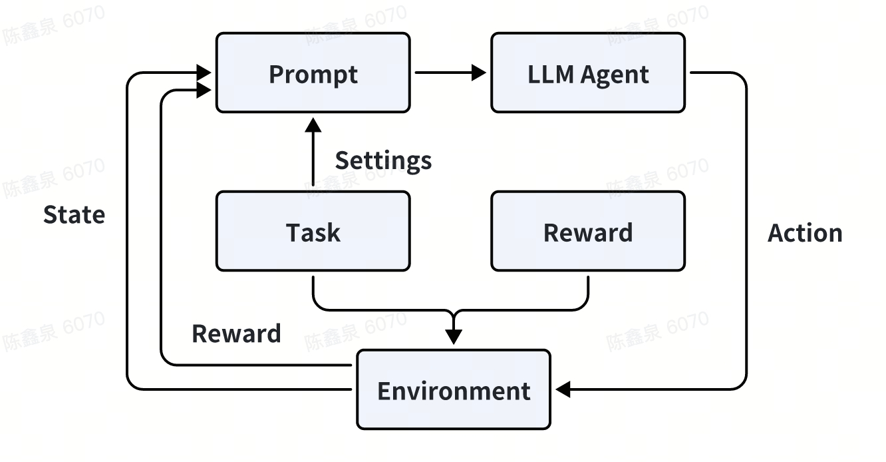

# AI Sandbox Environment

一个基于 **OpenAI Gym** 的通用 AI 沙箱环境，用于模拟、评估和分析大语言模型（LLM）在不同任务与场景下的表现。

本项目旨在为研究者和开发者提供一个统一的平台，用于：

* 兼容任意任务、环境、奖励函数
* 集成LLM作为智能体
* 记录和可视化运行过程

## AI Sandbox 特性

1. 模块化通用环境构建
    
    * 基于OpenAI Gym的抽象接口，模块化解耦设计

    * 支持用户自定义**任务设定**、**奖励函数**、**动作空间** 和 **观察空间**

    * 兼容任意类型的任务和模拟环境（工具调用、数字世界、物理时间和混合世界）

2. LLM Agent 集成

    * 支持通过 **API调用** 或 **vLLM 部署** 接入大语言模型

    * 智能体可直接与环境交互，完成指定任务

3. AI透明可观测

    * 记录智能体与环境每一步交互中的关键变量（Action，State，Reward）

    * 提供统一日志格式，接入数据库，方便数据分析

    * 可视化环境运行过程与智能体表现，实现透明观测界面使AI行为可解释

4. 训练数据共享

    * 结合Reward构建正负样本收集训练数据

## 模块说明



### Task 模块

在 Task 模块中，用户可以自定义任务逻辑与规则，描述智能体需要完成的目标。其由 Task 类来进行包装与定义。用户主要对任务做出以下的定义：

* 定义任务逻辑（例如股票买卖、路径规划、信息收集）

* 定义**动作空间 (action_space)** 与 **观察空间 (observation_space)**

* 提供环境初始化状态和任务完成判定

```python
from abc import ABC, abstractmethod
import gym

class BaseTask(ABC):
    @abstractmethod
    def action_space(self) -> gym.Space:
        """定义动作空间"""
        pass

    @abstractmethod
    def observation_space(self) -> gym.Space:
        """定义观察空间"""
        pass

    @abstractmethod
    def get_initial_state(self):
        """初始化任务状态"""
        pass

    @abstractmethod
    def terminal_judge(self):
        """终止状态判断"""
        pass
```

### Reward 模块

在 Reward 模块中，支持任意评估手段，其主要功能是：

* 独立封装奖励逻辑

* 通过状态与动作输入，返回Reward

```python
from abc import ABC, abstractmethod

class BaseReward(ABC):
    @abstractmethod
    def compute(self, old_state, action, new_state):
        pass
```

### Environment 模块

在 Environment 模块中，提供了各类环境模版来作为初始环境，用户也可以通过继承Environment基类定制自己的环境以适应任务。该模块的功能如下：

* 作为任务与奖励的统一容器

* 提供标准 Gym 接口（reset/step/render）

* 调用Task获取环境初始化，调用Reward获取奖励评估

### LLM Agent 模块

在 LLM Agent 模块中，LLM被初始化为环境中的Agent，用于根据当前环境的状态，给出下一步的动作。该模块的功能如下：

* 接收Task提供的任务设定，并根据当前环境的状态，给出下一步的动作

* 调用 LLM API/vLLM 服务

```python
from abc import ABC, abstractmethod

class BaseAgent(ABC):
    def __init__(self, model_name, api_url, api_key):
        self.client = openai.OpenAI(base_url=api_url, api_key=api_key)
        self.model_name = model_name

    @abstractmethod
    def format_system_prompt(self, task: str) -> str:
        """输入 任务设定 构建 system prompt"""

    @abstractmethod
    def act(self, observation) -> int:
        """输入环境状态，输出动作 ID"""
        pass
```


