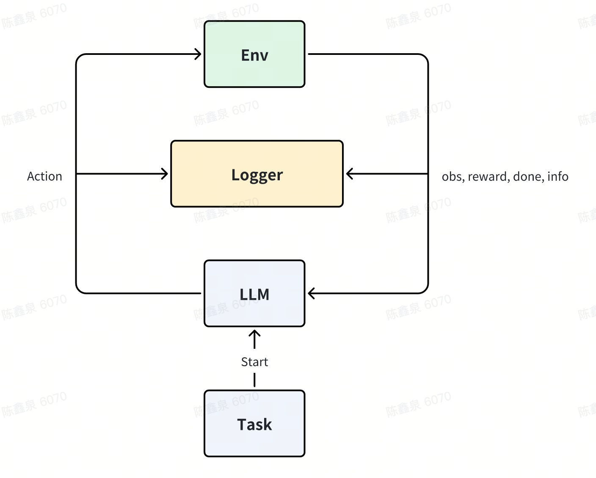

# AI Sandbox Environment

现有的Sandbox场景局限（computer use， code use），

一个通用 AI 沙箱开发套件，拥有一套通用接口，可兼容任意任务、环境和评估手段的xx技术平台

本项目旨在为大模型和智能体开发者提供一个统一的平台。对于大模型开发者来说，开发人员可以在该平台上测试不同任务不同环境基座模型Agentic表现，对于具体业务的智能体开发者来说可以在一套统一的Pipeline上测试和选型不同的模型，最终所有的测试结果可以被固化为模型训练数据，不断提升模型能力。

## Quick Start

### 垂直领域大模型业务开发者（一个环境评测多个模型）

（这类开发者设计环境，但不懂模型，准备好自己的环境后，评测大模型）

```python
import Gym
from simulator import Simulator
from models import ModelAPI
from envs import EnvAPI
from tasks import Task

llm_list = ModelAPI(['gpt-4o-mini', 'Qwen-2.5-VL-72B'])
user_env = Gym.make('user_env_name') # 自定义的环境
env_api = EnvAPI(user_env) # 环境调用包装成API

sim = Simulator(env_api, llm_list)

task = Task('user_env_task.json')

logger, report, dataset = sim.run(task)  
```

### 基座模型开发者（一个模型评测多个环境）

（这类开发者需要测试和提升模型，但不懂环境，准备好自己的模型后，选择一些适配的环境开始模拟）

```python
from vllm import LLM
from simulator import Simulator
from models import ModelAPI
from envs import EnvAPI
from tasks import Task

llm = LLM('user_model_name') # 自定义的LLM
llm_api = ModelAPI(llm) # 模型调用包装成API
env_list = EnvAPI(['minecraft-v0', 'android_world-v0'])

sim = Simulator(env_list, llm_api)

task_list = Task(['mincraft-v0-default-task.json', 'android_world-v0-default-task.json'])

loggers, reports, datasets = sim.run(task_list)
```


## 模块说明



### Task 模块

在 Task 模块中，用户可以自定义任务逻辑与规则，描述智能体需要完成的目标。其由 Task 类来进行包装与定义。用户主要对任务做出以下的定义：

* 定义任务逻辑（例如股票买卖、路径规划、信息收集）

* 定义**动作空间 (action_space)** 与 **观察空间 (observation_space)**

* 提供环境初始化状态和任务完成判定

```python
from abc import ABC, abstractmethod
import gym

class BaseTask(ABC):
    @abstractmethod
    def action_space(self) -> gym.Space:
        """定义动作空间"""
        pass

    @abstractmethod
    def observation_space(self) -> gym.Space:
        """定义观察空间"""
        pass

    @abstractmethod
    def get_initial_state(self):
        """初始化任务状态"""
        pass

    @abstractmethod
    def terminal_judge(self):
        """终止状态判断"""
        pass
```

<!-- ### Reward 模块

在 Reward 模块中，支持任意评估手段，其主要功能是：

* 独立封装奖励逻辑

* 通过状态与动作输入，返回Reward

```python
from abc import ABC, abstractmethod

class BaseReward(ABC):
    @abstractmethod
    def compute(self, old_state, action, new_state):
        pass
``` -->

### Environment 模块

在 Environment 模块中，提供了各类环境模版来作为初始环境，用户也可以通过继承Environment基类定制自己的环境以适应任务。该模块的功能如下：

* 作为任务与奖励的统一容器

* 提供标准 Gym 接口（reset/step/render）

* 调用Task获取环境初始化，调用Reward获取奖励评估

### LLM Agent 模块

在 LLM Agent 模块中，LLM被初始化为环境中的Agent，用于根据当前环境的状态，给出下一步的动作。该模块的功能如下：

* 接收Task提供的任务设定，并根据当前环境的状态，给出下一步的动作

* 调用 LLM API/vLLM 服务

```python
from abc import ABC, abstractmethod

class BaseAgent(ABC):
    def __init__(self, model_name, api_url, api_key):
        self.client = openai.OpenAI(base_url=api_url, api_key=api_key)
        self.model_name = model_name

    @abstractmethod
    def format_system_prompt(self, task: str) -> str:
        """输入 任务设定 构建 system prompt"""

    @abstractmethod
    def act(self, observation) -> int:
        """输入环境状态，输出动作 ID"""
        pass
```


