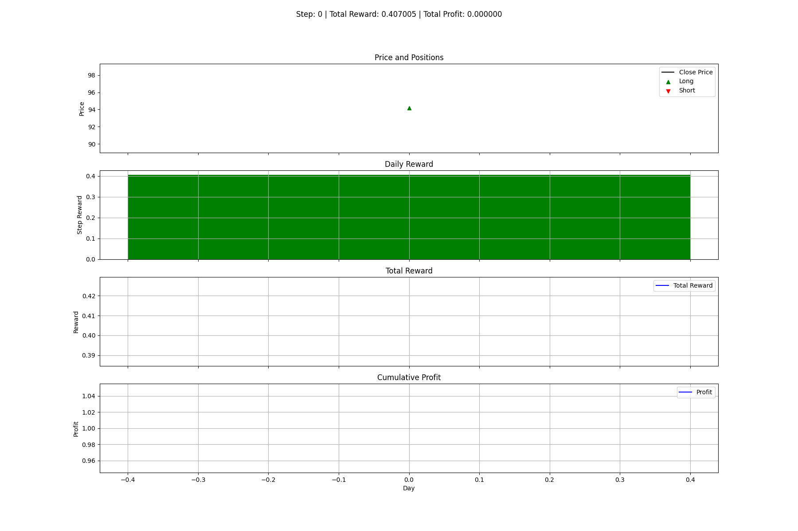
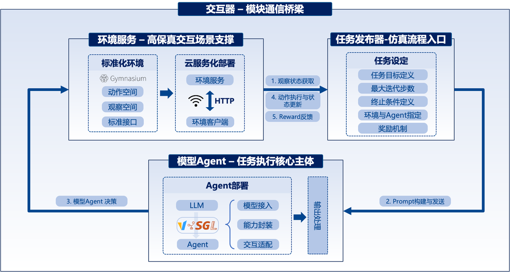
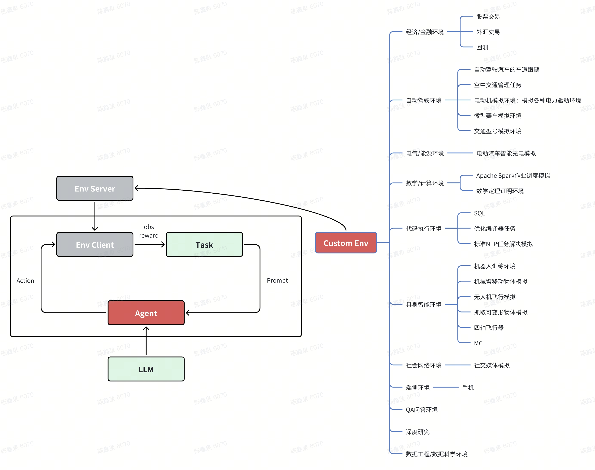

# AI Sandbox Environment

一个通用 AI 沙箱开发套件，提供标准化接口，兼容任意任务、环境和评估手段，实现对多个真实世界环境的逼真建模；内置交易、安卓交互、检索等多种开箱即用的预配置环境，同时具备完善的环境生命周期管理能力，支持高并发处理以显著提升强化学习训练效率，并提供多种运行模式以兼容不同的用户环境配置。

本项目旨在为大模型和智能体开发者提供统一平台：

* 大模型开发者可测试不同任务与环境下基座模型的 Agentic 表现
* 业务智能体开发者可在统一 Pipeline 上测试和选型不同模型
* 所有测试结果可固化为模型训练数据，形成能力提升闭环
* 依托环境生命周期管理与高并发处理机制，大幅提升强化学习训练效率
* 灵活的运行模式（本地 / 远程）适配不同用户的环境配置，降低部署与使用门槛
* 内置交易、安卓交互、检索、操作系统交互等多种预配置环境，开箱即用无需重复适配

## 🚀 Quick Start

### 安装依赖

```bash
# 克隆仓库
git clone https://gitee.pjlab.org.cn/L2/safeai/kilab/AISandbox.git
cd AISandbox

# 安装核心依赖
pip install -r requirements.txt

#配置核心参数 
llm-url,llm-api-key, llm-model 以及运行模式 mode,

python launcher.py \
  --mode local \
  --manager-config /manager/config.yaml \
  --env-config <required_testing_env> \
  --llm-base-url <http://example_llm_url>\
  --llm-api-key <LLM service required key > \  # set to EMPTY when api key is not required
  --llm-model Qwen3-30B-Instruct \
  --pool-size 2 
  
```

### 本地模式运行
* 本地模式下，框架会自动启动环境 HTTP 服务（默认端口 36663）；若需手动启动，可执行
```aiignore
python -m uvicorn env.app:app --host 0.0.0.0 --port 36663
```
* LLM 服务需提前部署（如 vLLM/SGLang），并确保--llm-base-url可访问


## 参数配置详解
框架配置分为命令行参数（Launcher） 和配置文件参数（config.yaml） 两类，支持分层覆盖（命令行参数优先级高于配置文件）。
### Launcher 命令行参数

| 参数分类   | 参数名                   | 说明                               | 默认值                   | 是否启动必须值 |
|--------|-----------------------|----------------------------------|-----------------------|---------|
| 配置文件   | --manager-config      | 框架核心配置文件路径                       | /manager/config.yaml  | 否       |
|        | --env-config          | 自定义环境任务配置文件路径                    | None                  | 否       |
|        | --env-root            | 环境配置根目录,与env_config互斥            | env                   | 否       |
| 运行模式   | --mode                | 运行模式（local/remote）               | local                 | 是       |
| 数据库    | --db-path             | SQLite 数据库路径                     | sqlite://test_envs.db | 是       |
|        | --storage-type       | Data 存储方式                    | sqlite                  | 是       |
|        | --rebuild-table       | 是否丢弃前一次推演任务环境                    | True                  | 否       |
| 环境池    | --pool-size           | 环境池大小（0 表示使用配置文件值）               | 0                     | 否       |
| 本地服务   | --local-upstream-port | 本地环境 HTTP 服务端口                   | 36663                 | 否       |
|        | --wait-timeout        | 等待本地服务启动超时时间（秒）                  | 60.0                  | 否       |
| 交互控制   | --max-steps           | 单个环境最大交互步数                       | 1000                  | 否       |
|        | --message-cut         | LLM 提示词保留的最近对话轮数                 | 3                     | 否       |
|        | --env-http-timeout-s  | 环境 HTTP 请求超时时间                   | 50.0                  |         |
|        | --workers             | 并发工作线程数（0 表示使用环境池大小）             | 0                     | 否       |
| LLM 配置 | --llm-base-url        | LLM 服务 API 地址                    | None                  | 是       |
|        | --llm-api-key         | LLM 服务 API 密钥                    | EMPTY                 | 否       |
|        | --llm-model           | LLM 模型名称                         | None                  | 是       |
|        | --llm-temperature     | LLM 生成温度                         | 0.3                   | 是       |
| 日志     | --log-dir             | 日志存储目录                           | logs                  | 否       |
|        | --console-log-level   | 控制台日志级别（DEBUG/INFO/WARNING/ERROR | INFO                  | 否       |
|        | --file-log-level      | 文件日志级别                           | DEBUG                 | 否       |

### 环境管理框架config.yaml 配置参数
  配置文件分为数据库、集群、RayJob、环境类型四大核心模块，关键参数说明如下：
1. 全局基础配置
```aiignore
mode: remote  # 运行模式（local/remote），可被命令行--mode覆盖
pool_size: 2  # 环境池默认大小，可被命令行--pool-size覆盖
```
2. 数据库配置
```aiignore
database:
  driver: "sqlite"          # 数据库驱动（仅支持sqlite）
  sqlite_path: "test_envs.db"  # 数据库路径，可被命令行--db-path覆盖
```
3. 集群配置（remote 模式生效）
```aiignore
cluster:
  base_image: "AAAA"        # 环境镜像（待废弃，将按环境类型区分）
  http:                     # 环境HTTP服务通用配置
    port: 36663             # 端口
    timeout_s: 100          # 管理器到环境集群的连接超时
    concurrency: 200        # 预热Actor时的最大并发HTTP调用数
  env_types:                # 各类型环境的专属配置
    trading_gym:            # 环境注册名
      quotagroup: "evobox_cpu_task"  # 资源配额组
      entrypoint: "python /app/app.py"  # 环境启动入口
      volumes:              # 挂载卷配置（示例）
        - fsType: "mount.brainpp.cn/gpfs"
          endpoint: "gpfs://gpfs1/evobox-share"
          containerPath: "/mnt/shared-storage-user/evobox-share"
      resources:            # 资源配置（head节点）
        head:
          cpu: 10
          gpu: 0
          memory: 20Gi
      limit: 30             # 环境实例上限
    # 其他环境类型（git_gym/mc/emb等）配置同trading_gym
```
4. RayJob 配置（remote 模式生效）
```aiignore
rayjob:
  domain: "https://h.pjlab.org.cn"  # RayJob平台域名
  tenant: "ailab"                   # 租户名
  access_key: "xxx"                 # 访问密钥
  secret_key: "xxx"                 # 密钥
  verify: false                     # 是否验证TLS证书（生产环境设为true）
  quotagroup: "evobox_cpu_task"     # 默认资源配额组
  project: "ailab-evobox"           # 项目名称
  description: "RL env Ray cluster" # 集群描述
```

### 运行交易环境示例

运行脚本前先使用推理框架（例如`vLLM`，`SGLang`）部署`LLM`并在`examples/run_8_trading_envs.sh`中配置`agent-api-key` `agent-base-url` `agent-model` `agent-temperature`。


```bash
# 脚本运行
bash examples/run_8_trading_envs.sh
```

## 🔥 自定义环境开发

### 1. 核心概念

- **环境（Environment）**：模拟真实世界场景的交互系统，提供观察状态和接收动作
- **智能体（Agent）**：基于LLM的决策主体，通过环境观察做出决策
- **交互器（Interactor）**：协调环境与智能体交互的核心控制器

### 2. 自定义环境与环境注册

#### 2.1 接口规范

一个标准的`Env`环境需要继承`core.env.base_env`中的`BaseEnv`并实现以下核心功能接口

<table>
    <tr>
        <td>类型</td>
        <td>组件</td>
        <td>说明</td>
    </tr>
    <tr>
        <td rowspan="3">Prompt</td>
        <td>observation_space</td>
        <td>定义智能体可以从环境中获取信息的格式、范围和类型，例如当日股价，股市情绪推文</td>
    </tr>
    <tr>
        <td>action_space</td>
        <td>定义智能体可以执行的动作的类型和范围，例如 买入 和 卖出</td>
    </tr>
    <tr>
        <td>get_task_prompt</td>
        <td>生成指导LLM决策的自然语言提示，并告知LLM的环境状态以及可用动作，例如 最大化股市收益</td>
    </tr>
    <tr>
        <td rowspan="4">Function</td>
        <td>reset()</td>
        <td>重置环境到初始状态，返回初始状态</td>
    </tr>
    <tr>
        <td>step(action)</td>
        <td>接收LLM回复解析动作并执行，更新环境状态，返回下一观测、奖励值、终止状态、截断状态、环境信息</td>
    </tr>
    <tr>
        <td>render()</td>
        <td>可视化环境状态，返回当前步骤环境可视化渲染图</td>
    </tr>
    <tr>
        <td>close()（可选）</td>
        <td>清理环境并释放资源</td>
    </tr>
</table>

#### 2.2 环境注册

环境类创建完成后导入`core.env.env_register`中的`register_env`方法并修饰新建的环境类，参数为环境的注册名，例如，

```python
# 导入register_env方法并修饰新建环境类，"trading_gym"为注册名
@register_env("trading_gym")
class TradingGym(BaseEnv):

    def __init__():
      pass
```

随后在`examples/base_eval.py`或`入口函数`中导入新类完成注册，例如，

```python
# 导入环境来注册
from env.tradinggym.trading_env import TradingGym  
```

可通过`core.env.env_register`中的 `list_registered_envs`方法来查看环境是否被注册

### 3. 交互模拟

`examples/base_eval.py`提供了基础的环境测试脚本，注册新环境后可实现全自动交互模拟，下面为示例以及参数解释，其中`env-config-yaml` 环境配置文件中每个环境应包含两个参数`env_name`和`env_params`，`env_params`中包含新创建的环境类中的所有参数配置。


### task_list：用列表列出环境任务，减少重复配置

为避免在 `env_params` 中重复写相似的 prompt/指令，现在支持在 YAML 里使用 `task_list`：

```yaml
environments:
  - env_name: android_gym
    env_num: 1
    # task_param 可选，标量任务会写入 env_params[task_param]；不写则写入通用键 task
    task_param: instruction
    env_params:
      adb_path: "/opt/android/platform-tools/adb"
      API_url: "http://host:port/v1/responses"
      token: "sk-..."
      # 这里放通用环境配置，不放指令
    task_list:
      - "Join my 3 PM meeting in Calendar..."
      - "Check my hotel reservation in Booking app..."

  - env_name: search
    env_num: 1
    # 数据集路径等基础参数放在 env_params
    env_params: {}
    task_param: dataset_index
    # 方式1：内联列表
    task_list: [0, 1, 2, 3, 4, 5]
    # 方式2：从文件导入（json/yaml列表，或按行一个任务）
    # task_list_file: "env/search/dataset_indices.txt"
```

规则：
- `task_list` 可为字符串/数字/对象列表。
  - 若元素是对象，直接与 `env_params` merge（可在对象里写任意参数）。
  - 若是标量，优先写入 `task_param` 指定的键；若未指定，落在通用键 `task`（环境端可以按约定读取）。
- 未提供 `task_list` 时保持旧格式兼容，直接使用 `env_params`。
- `task_list_file` 支持外部列表文件，格式：json/yaml 列表；或纯文本按行一个任务（支持注释行 `#`，数字会自动转 int，行内容可为 JSON 片段）。

## 📺 交互与指标可视化

项目提供多维度可视化能力，直观展示交互过程：

1. 环境状态可视化

  若环境实现了`render()`方法，环境会在每一步保存状态图片，最终合成GIF展示完整过程

2. 交互流程可视化

  可展示智能体每一步的决策

3. 性能指标可视化

  支持生成奖励曲线等统计图表，便于分析智能体表现



## 📰 交互数据 log 记录

项目使用 SQLite 数据库记录 LLM 与环境的交互数据，便于后续分析和查询：

### 数据存储结构

- **`interaction_sessions`表**：存储会话级元数据
  - 环境名称、模型名称、开始时间、结束时间、总奖励、完成状态等。

- **`interaction_steps`表**：存储步骤级详细，
  - 会话 ID、步骤编号、时间戳、环境状态
  - Prompt、Response、奖励值、完成状态等。

### 日志记录流程

  - 每个环境的模拟开始时，创建一条会话记录
  - 每一步交互都会创建一条步骤记录，包含当前步的 Prompt、Response 和 Reward 等信息
  - 模拟完成后，更新会话记录的总奖励、结束时间和完成状态

### 日志查询方法

```bash
# 列出最近的会话
python scripts/query_interactions.py --list

# 查看指定会话的详细信息
python scripts/query_interactions.py --session-id 123
```

数据文件位于项目根目录：`llm_env_interactions.db`。


## 📦 模块说明



<!--  -->

### Environment 服务
环境服务是沙箱仿真引擎的基础支撑模块，其核心目标是为大模型智能体提供多样化、可扩展且高保真的交互环境，以满足不同场景下的评测需求。为了实现这一目标，环境服务在设计上采用了模块化、标准化的架构，同时具备灵活的扩展能力与高效的部署方式。

### 模型Agent服务
模型 Agent 是沙箱仿真引擎中执行任务的核心主体，其功能是将大语言模型转化为具备自主决策能力、能够与环境交互的智能体。

集成主流的推理后端框架：vLLM 与 SGLang 等。

### 交互器

交互器是连接模型 Agent 与环境服务的关键桥梁，其核心功能是实现 Agent 与环境之间的动态交互，驱动仿真过程的循环进行。交互器的交互逻辑遵循 “观察 - 决策 - 执行 - 反馈” 的循环机制，具体流程如下：

1. 观察状态获取：交互器首先向环境服务发送状态获取请求，环境服务通过step()方法（初始阶段通过reset()方法）生成当前环境的观察状态，并将其按照预设格式返回给交互器。

2. Prompt构建与发送：交互器将获取到的环境观察状态与当前任务目标进行整合，构建符合大模型理解习惯的 Prompt。清晰描述环境状态、任务要求以及可执行的动作范围，确保 Agent 能够准确理解当前场景与任务目标。随后，交互器将构建好的 Prompt 发送至模型 Agent。

3. 模型Agent决策：模型 Agent 基于接收到的 Prompt 进行推理，生成下一步的动作指令，并将其返回给交互器。

4. 动作执行与状态更新：交互器将动作指令发送至环境服务，环境服务调用step()方法执行该动作，并根据动作的执行结果更新环境状态，同时计算对应的奖励值，判断是否达到仿真终止条件。

5. 反馈与循环：环境服务将更新后的环境状态、奖励值以及终止标志返回给交互器，交互器将这些信息反馈给模型 Agent，并根据终止标志判断是否结束仿真循环。若未达到终止条件，交互器将再次获取新的环境观察状态，进入下一轮交互循环；若达到终止条件，则结束当前仿真任务，并记录仿真结果。

### 任务发布器

任务发布器是沙箱仿真引擎的仿真流程入口，其核心功能是根据用户的评测需求，定义仿真任务的目标、规则与参数，驱动环境服务、模型 Agent 与交互器协同工作，完成整个仿真评测过程。

任务发布器支持用户通过 API 接口进行任务参数配置，主要参数包括：任务目标定义、最大迭代步数、终止条件定义、环境与Agent指定和奖励机制配置
